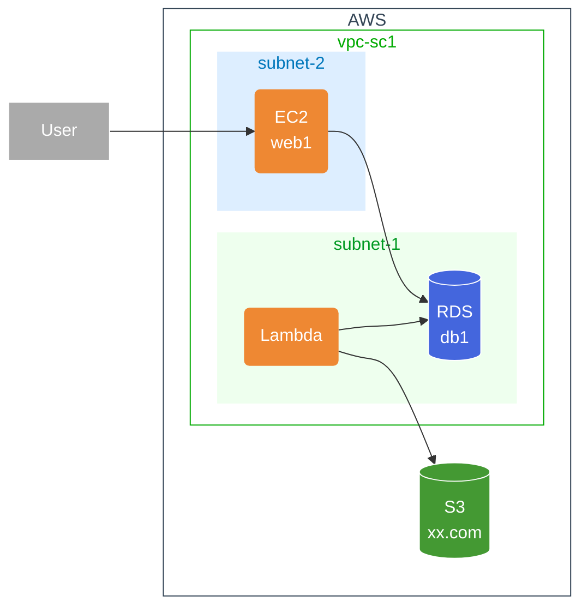

# Lambda を使用して S3 から RDS にデータを移行する方法について

## 導入

新人研修の成果物を作る際に、S3 に保存していた画像データを RDS に移行する必要がありました。その際に、Lambda を使用して S3 から RDS にデータを移行する方法を調べたので、その内容をまとめます。

## バックグラウンド

### Lambda とは

AWS が提供しているサーバーレスコンピューティングサービスです。Lambda を使用することで、サーバーの管理やスケーリングなどを気にすることなく、コードを実行することができます。これにより、エンジニアはインフラ側のことを気にすることなく、ビジネスロジックなどのコアな部分に集中することができます。

## 方法

### VPCの作成

LambdaからRDSにアクセスするためには、両方が同じVPC内に配置されている必要があります。そのため、まずはVPCを作成します。
インフラ構成図は以下のようになります。

### ロールの作成

LambdaからS3とRDSにアクセスするために、それぞれの権限を持ったロールを作成します。

#### 1.S3へのアクセス権限を持ったロールの作成

1. IAM のコンソール画面を開きます。
2. 左側のメニューから「ロール」を選択します。
3. 「ロールの作成」をクリックします。
4. 「AWS サービス」を選択し、「Lambda」を選択します。
5. 「次のステップ: アクセス権限」をクリックします。
6. 「AmazonS3ReadOnlyAccess」を選択します。
7. 「次のステップ: タグ」をクリックします。
8. 「次のステップ: 確認」をクリックします。
9. 「ロール名」に任意の名前を入力し、「ロールの作成」をクリックします。

#### 2.RDSへのアクセス権限を持ったロールの作成

1. IAM のコンソール画面を開きます。
2. 左側のメニューから「ロール」を選択します。
3. 「ロールの作成」をクリックします。
4. 「AWS サービス」を選択し、「Lambda」を選択します。
5. 「次のステップ: アクセス権限」をクリックします。
6. 「AmazonRDSFullAccess」を選択します。
7. 「次のステップ: タグ」をクリックします。
8. 「次のステップ: 確認」をクリックします。
9. 「ロール名」に任意の名前を入力し、「ロールの作成」をクリックします。

#### 3.Lambda関数に作成したロールをアタッチする

Lambdaのコンソールにアクセスし、作成したLambda関数を選択し、その後ロールの編集をクリックします。ロールの編集画面が表示されたら、先ほど作成したロールを選択し、保存をクリックします。

#### 4.VPCの設定

Lambda関数をRDSにアクセスできるようにするために、VPCの設定を行います。
まず、Lambdaのコンソールにアクセスし、VPCの設定をクリックします。VPCの設定画面が表示されるので、VPCを選択し、サブネットを選択します。その後、セキュリティグループを選択し、RDSのセキュリティグループを選択します。最後に、保存をクリックします。

#### 5.Lambda関数の作成

今回はPython3.9を使用してLambda関数を作成します。作成したら、圧縮しzipファイルにします。zipファイルをLambda関数にアップロードします。

#### 6.Lambda関数の実行

Lambda関数を実行すると、S3からRDSにデータが移行されます。

## 結果や影響

以上がS3からRDSにデータを移行する方法です。

## まとめ

Lambdaを使用してS3からRDSにデータを移行する方法についてまとめました。今回は、S3からRDSにデータを移行する方法を調べたので、その内容をまとめました。
